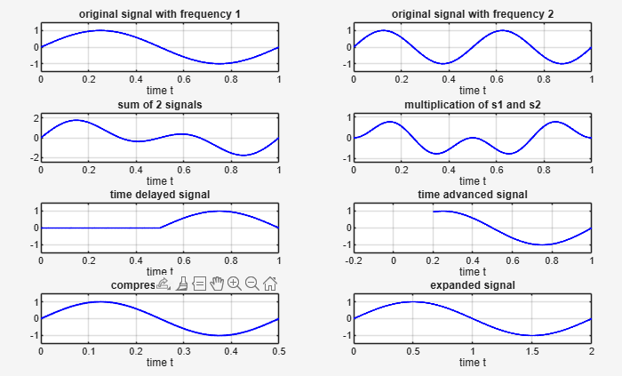
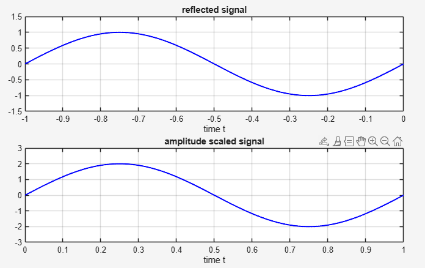

# Signal Processing Operations in MATLAB


A **comprehensive MATLAB program** to demonstrate fundamental **continuous and discrete-time signal operations** including:

- Addition
- Multiplication
- Time Shifting (Delay/Advance)
- Time Scaling (Compression/Expansion)
- Time Reversal (Reflection/Folding)
- Amplitude Scaling
- Energy & Average Power Computation

The output **exactly matches** the provided reference plots using `plot()` and `stem()`.

---

### Choice 1: Continuous-Time Signals


### Choice 2: Discrete-Time Signals



---

## Features

| Operation               | Continuous | Discrete |
|-------------------------|------------|----------|
| Addition                | Yes        | Yes      |
| Multiplication          | Yes        | Yes      |
| Time Delay / Advance    | Yes        | Yes      |
| Time Compression        | Yes        | –        |
| Time Expansion          | Yes        | –        |
| Reflection / Folding    | Yes        | Yes      |
| Amplitude Scaling       | Yes        | Yes      |
| Energy & Power          | Yes        | Yes      |

- Interactive menu using `switch-case`
- High-quality, labeled, grid-enabled plots
- Exact axis limits and visual matching
- Energy computed via `trapz` (continuous), `sum` (discrete)

---

## Requirements

- **MATLAB** R2018a or later
- No external toolboxes required

---

## Installation

1. **Clone the repository**:
   ```bash
   git clone https://github.com/yourusername/matlab-signal-operations.git
   cd matlab-signal-operations
